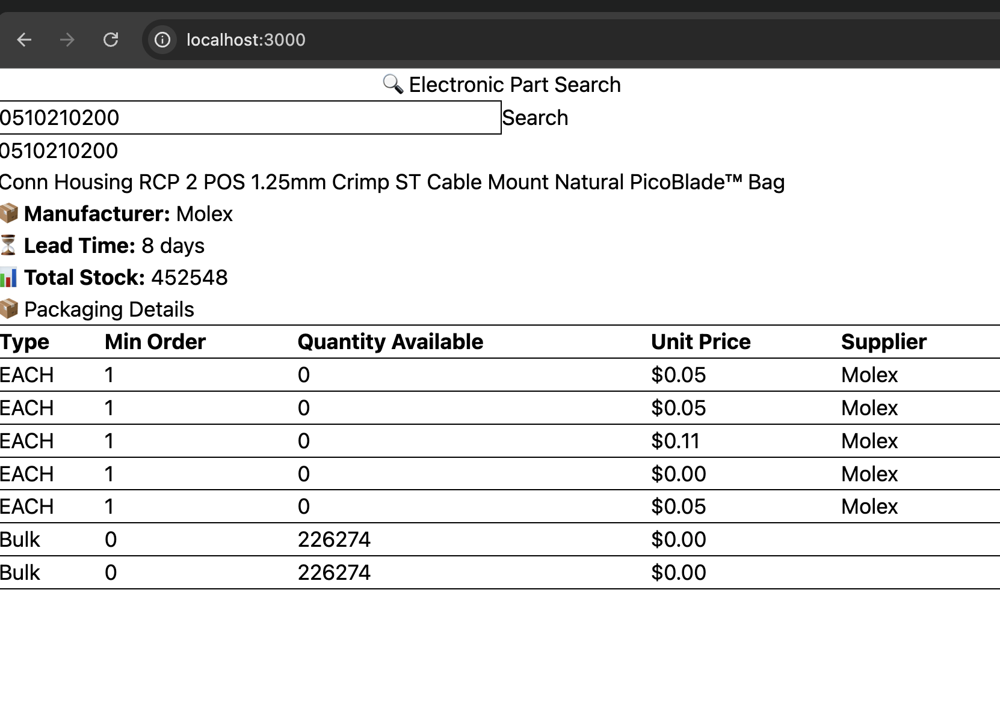
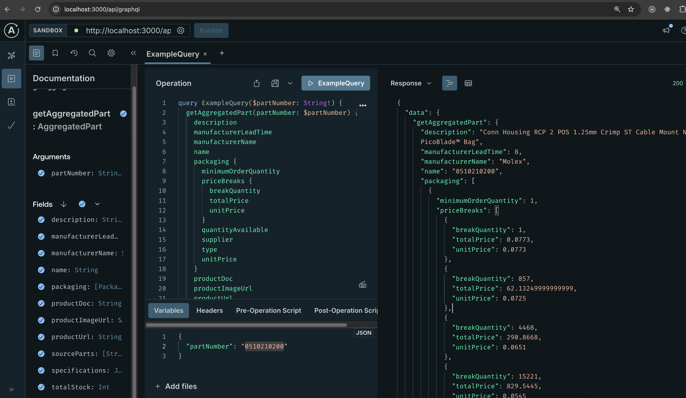

This is a bread-board app

## Local setup

First, install dependencies:

```bash
npm install

```

And then, run the development server:

```bash
npm run dev

```

Open [http://localhost:3000](http://localhost:3000) with your browser to see the result.


Open [http://localhost:3000/api/graphql](http://localhost:3000/api/graphql) with your browser to interact with GraphQL playground

